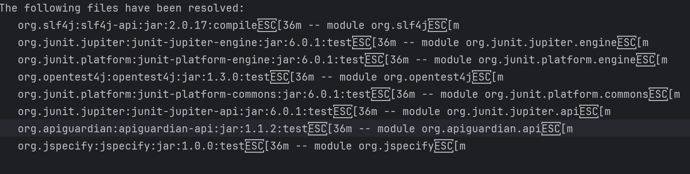

This repository was created to reproduce defect MDEP-839.

1. Run following command from a Windows terminal:
`mvn clean package site`
2. Open file [maven_dependencies_list.txt](reports/maven-dependency-plugin-ansi-codes-bug/dependency/maven_dependencies_list.txt)
3. Observe that ANSI escape characters are printed out in the file:
